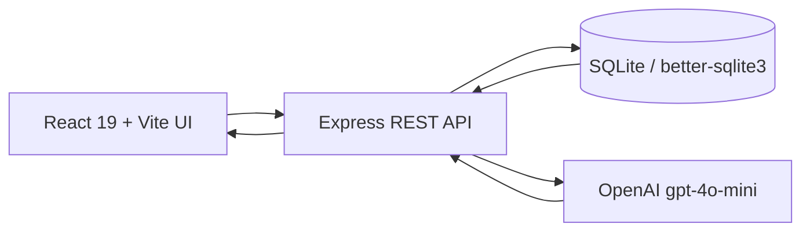

# Vendor Risk Scoring and Contract Compliance Monitor

## 1. Product Goal
Build a hackathon-ready platform that continuously monitors third-party vendors, calculates explainable risk scores, detects SLA issues, summarizes obligations, and generates executive-ready vendor risk reports.

The architecture is intentionally simple to run locally in under 2 minutes, but the data model, API shape, and UI composition are designed to feel enterprise-grade.

## 2. Reference Stack
- Backend: Node.js 22 + Express.js
- Database: SQLite + better-sqlite3
- Frontend: React 19 + Vite
- AI: OpenAI `gpt-4o-mini`
- Auth: none for hackathon demo

## 3. Architecture Overview


### Core design choices
- Keep the whole stack local and deterministic.
- Store every AI run in `ai_analysis_runs` for auditability.
- Keep risk scoring explainable by persisting the dimension scores and rationale JSON.
- Use synchronous reads for the dashboard and async-ish analysis endpoints for report generation.

## 4. SQLite Schema
The complete DDL lives in [schema/vendor-risk-platform.sql](./schema/vendor-risk-platform.sql).

### Schema intent
- `vendors`: master vendor registry.
- `contracts`: one or more contracts per vendor.
- `contract_obligations`: measurable obligations, SLA terms, and renewal duties.
- `risk_signals`: normalized signal stream for financial, cyber, and compliance events.
- `sla_breaches`: first-class breach records with evidence.
- `risk_scores`: immutable score snapshots.
- `ai_analysis_runs`: full audit trail for every model invocation.
- `alerts`: operational items surfaced to the UI.
- `audit_log`: system-wide activity history.

### Enterprise-grade constraints
- Enforced enum-like `CHECK` constraints for status, severity, risk level, and analysis type.
- Foreign keys are enabled and cascade or nullify appropriately.
- Scores are clamped to `0-100`.
- Contract value range is constrained to `$50K-$5M` in cents.
- Indexes are optimized for dashboard browsing, vendor drill-down, and breach timelines.

## 5. REST API Contract

### Common response envelope
```json
{
  "data": {},
  "meta": {
    "requestId": "req_123",
    "generatedAt": "2026-06-05T10:00:00Z"
  }
}
```

### Common error envelope
```json
{
  "error": {
    "code": "INVALID_INPUT",
    "message": "Contract end_date must be after start_date.",
    "details": []
  }
}
```

### 5.1 Health
`GET /api/health`

Response:
```json
{ "data": { "status": "ok", "db": "ready", "ai": "ready" } }
```

### 5.2 Dashboard summary
`GET /api/dashboard/summary`

Response shape:
```json
{
  "data": {
    "vendorCount": 10,
    "criticalCount": 3,
    "openBreaches": 3,
    "avgOverallScore": 61,
    "riskDistribution": {
      "LOW": 3,
      "MEDIUM": 3,
      "HIGH": 1,
      "CRITICAL": 3
    },
    "topRisks": [
      {
        "vendorId": 7,
        "vendorName": "Plaid",
        "riskLevel": "CRITICAL",
        "overallScore": 36
      }
    ]
  }
}
```

### 5.3 Vendors
`GET /api/vendors?search=&industry=&riskLevel=&status=&page=&pageSize=`

Response shape:
```json
{
  "data": {
    "items": [
      {
        "id": 7,
        "vendorCode": "VND-007",
        "displayName": "Plaid",
        "primaryIndustry": "fintech",
        "status": "monitoring",
        "latestScore": {
          "overallScore": 36,
          "riskLevel": "CRITICAL",
          "scoredAt": "2026-06-05T10:00:00Z"
        }
      }
    ],
    "page": 1,
    "pageSize": 20,
    "total": 10
  }
}
```

`POST /api/vendors`

Request:
```json
{
  "vendorCode": "VND-011",
  "legalName": "New Vendor LLC",
  "displayName": "New Vendor",
  "primaryIndustry": "retail",
  "headquartersCountry": "US",
  "status": "active"
}
```

Response: `201 Created` with the created vendor object.

`GET /api/vendors/:vendorId`

Response shape:
```json
{
  "data": {
    "vendor": { "id": 7, "displayName": "Plaid" },
    "contracts": [],
    "latestScore": {},
    "openBreaches": [],
    "recentSignals": []
  }
}
```

`PATCH /api/vendors/:vendorId`

Request:
```json
{
  "status": "monitoring"
}
```

### 5.4 Contracts
`GET /api/vendors/:vendorId/contracts`

`POST /api/vendors/:vendorId/contracts`

Request:
```json
{
  "contractNumber": "CNT-2026-011",
  "title": "Managed Hosting",
  "businessUnit": "Infrastructure",
  "ownerName": "Sara Lopez",
  "startDate": "2026-01-01",
  "endDate": "2027-01-01",
  "renewalType": "auto",
  "autoRenew": true,
  "renewalNoticeDays": 90,
  "currencyCode": "USD",
  "contractValueCents": 250000000,
  "status": "active",
  "riskReviewDueDate": "2026-09-01"
}
```

`GET /api/contracts/:contractId`

Response shape:
```json
{
  "data": {
    "contract": {
      "id": 7,
      "title": "Account Linking and Data Connectivity Services",
      "status": "at_risk"
    },
    "obligations": [],
    "breaches": [],
    "riskSignals": []
  }
}
```

`PATCH /api/contracts/:contractId`

Request:
```json
{
  "status": "at_risk",
  "riskReviewDueDate": "2026-06-12"
}
```

### 5.5 Obligations
`GET /api/contracts/:contractId/obligations`

`POST /api/contracts/:contractId/obligations`

Request:
```json
{
  "obligationCode": "SLA-AVAIL-99_95",
  "category": "sla",
  "obligationType": "uptime",
  "description": "Monthly platform uptime must remain at or above 99.95 percent.",
  "targetValue": 99.95,
  "targetUnit": "percent",
  "thresholdOperator": ">=",
  "criticality": "critical",
  "dueDate": null,
  "recurrence": "monthly",
  "status": "open"
}
```

### 5.6 Risk scoring
`POST /api/vendors/:vendorId/score`

Request:
```json
{
  "contractId": 7,
  "forceRecompute": true,
  "analysisType": "risk_scoring"
}
```

Response:
```json
{
  "data": {
    "vendorId": 7,
    "contractId": 7,
    "financialScore": 28,
    "cyberScore": 44,
    "complianceScore": 31,
    "overallScore": 36,
    "riskLevel": "CRITICAL",
    "drivers": [
      "Repeated late payments",
      "Active SLA breach",
      "Open critical vulnerability"
    ],
    "recommendations": [
      "Escalate to procurement and legal",
      "Place vendor on weekly review cadence",
      "Require remediation plan within 5 business days"
    ]
  }
}
```

### 5.7 SLA breach detection
`POST /api/contracts/:contractId/detect-breaches`

Request:
```json
{
  "analysisType": "sla_breach_detection",
  "scanWindowDays": 30,
  "forceRecompute": true
}
```

Response:
```json
{
  "data": {
    "breaches": [
      {
        "breachCode": "BR-2026-007-A",
        "breachType": "uptime_sla_miss",
        "severity": "critical",
        "status": "open",
        "description": "Monthly uptime fell below 99.95 percent."
      }
    ],
    "createdCount": 1
  }
}
```

### 5.8 Obligation summary
`POST /api/contracts/:contractId/summarize-obligations`

Request:
```json
{
  "analysisType": "obligation_summary",
  "format": "json"
}
```

Response:
```json
{
  "data": {
    "summary": "4 of 6 obligations are on track; 1 is at risk and 1 is breached.",
    "obligations": [
      {
        "obligationCode": "SLA-AVAIL-99_95",
        "status": "breached",
        "criticality": "critical",
        "dueDate": null
      }
    ]
  }
}
```

### 5.9 Vendor risk report
`POST /api/vendors/:vendorId/report`

Request:
```json
{
  "contractId": 7,
  "includeHistoryDays": 90,
  "analysisType": "vendor_risk_report"
}
```

Response:
```json
{
  "data": {
    "reportId": 91,
    "vendorId": 7,
    "executiveSummary": "Vendor is critical due to active SLA breach and multiple high-severity signals.",
    "sections": {
      "scoreBreakdown": {},
      "breaches": [],
      "obligations": [],
      "recommendedActions": []
    }
  }
}
```

### 5.10 Alerts
`GET /api/alerts?status=open&severity=critical`

`PATCH /api/alerts/:alertId`

Request:
```json
{
  "status": "acknowledged"
}
```

## 6. AI Prompt Templates

### 6.1 Score vendor risk level
**System prompt**
```text
You are an enterprise vendor risk engine. Score the vendor using only the supplied evidence.
Return valid JSON only. Do not include markdown, commentary, or extra keys.
Be conservative when evidence is missing. Prefer explainability over verbosity.
```

**User prompt**
```text
Vendor profile:
{{vendor_json}}

Contracts:
{{contracts_json}}

Financial signals:
{{financial_signals_json}}

Cyber signals:
{{cyber_signals_json}}

Compliance signals:
{{compliance_signals_json}}

Scoring rules:
- Financial score, cyber score, and compliance score must each be integers from 0 to 100.
- Overall score = round(0.3 * financial + 0.4 * cyber + 0.3 * compliance)
- Risk levels:
  80-100 = LOW
  60-79 = MEDIUM
  40-59 = HIGH
  0-39 = CRITICAL

Return this JSON shape:
{
  "financial_score": number,
  "cyber_score": number,
  "compliance_score": number,
  "overall_score": number,
  "risk_level": "LOW" | "MEDIUM" | "HIGH" | "CRITICAL",
  "top_drivers": string[],
  "recommended_actions": string[],
  "confidence": number,
  "rationale": string
}
```

### 6.2 Detect SLA breaches
**System prompt**
```text
You are a contract operations analyst. Detect SLA breaches from the evidence provided.
Return valid JSON only. Prefer precise, operational language.
```

**User prompt**
```text
Contract:
{{contract_json}}

Obligations:
{{obligations_json}}

Observed SLA evidence:
{{sla_events_json}}

Return:
{
  "breaches": [
    {
      "breach_code": string,
      "breach_type": string,
      "severity": "low" | "medium" | "high" | "critical",
      "status": "open" | "acknowledged" | "resolved" | "waived",
      "detected_at": string,
      "description": string,
      "evidence": string[],
      "recommended_remediation": string
    }
  ],
  "summary": string,
  "confidence": number
}
```

### 6.3 Summarize contract obligations
**System prompt**
```text
You are a contract intelligence assistant. Summarize obligations with an executive tone and a compliance lens.
Return valid JSON only.
```

**User prompt**
```text
Contract:
{{contract_json}}

Obligations:
{{obligations_json}}

Return:
{
  "summary": string,
  "overall_status": "on_track" | "watch" | "at_risk" | "breached",
  "obligations": [
    {
      "obligation_code": string,
      "category": string,
      "status": "open" | "met" | "at_risk" | "breached" | "waived",
      "criticality": "low" | "medium" | "high" | "critical",
      "plain_english_summary": string,
      "next_due_date": string | null
    }
  ],
  "top_risks": string[]
}
```

### 6.4 Generate vendor risk report
**System prompt**
```text
You are an enterprise risk reporting engine. Create a concise, board-ready vendor risk report.
Return valid JSON only. Include executive summary, evidence-based findings, and action items.
```

**User prompt**
```text
Vendor:
{{vendor_json}}

Contract:
{{contract_json}}

Risk scores:
{{risk_score_json}}

Breaches:
{{breaches_json}}

Obligations:
{{obligations_json}}

Recent signals:
{{signals_json}}

Return:
{
  "executive_summary": string,
  "key_findings": string[],
  "score_breakdown": {
    "financial": number,
    "cyber": number,
    "compliance": number,
    "overall": number,
    "risk_level": string
  },
  "breaches": array,
  "obligations": array,
  "recommended_actions": string[],
  "escalation_level": "none" | "manager" | "director" | "executive",
  "confidence": number
}
```

### Prompt execution settings
- Model: `gpt-4o-mini`
- Temperature: `0.1` for scoring and breach detection, `0.2` for reports
- Response format: JSON schema or strict JSON mode
- Persist the raw input and output in `ai_analysis_runs`

## 7. Risk Scoring Algorithm

### 7.1 Dimension scores
Each dimension starts at `100` and is reduced by weighted deductions from the latest evidence.

#### Financial score inputs
- Late payment trend
- Invoice dispute count
- Payment default or arrears
- Credit rating downgrade
- Concentration risk
- Contract value pressure

#### Cyber score inputs
- Open critical vulnerabilities
- Expired or missing security certifications
- Breach history
- Patch latency
- Pen test exceptions
- Data handling exceptions

#### Compliance score inputs
- SLA misses
- Unmet obligations
- Renewal notice misses
- Reporting delays
- Unresolved remediation items

### 7.2 Recommended deduction model
Use the latest 90 days for the default dashboard score.

```text
severity deduction:
low = 3
medium = 10
high = 20
critical = 35
```

Example:
```text
score = clamp(100 - sum(deductions) + positive_offsets, 0, 100)
```

Positive offsets can be applied for:
- Recent on-time payments
- Current security certifications
- Fully met obligations
- No breaches in the lookback window

### 7.3 Overall score
```text
overall = round((financial * 0.3) + (cyber * 0.4) + (compliance * 0.3))
```

### 7.4 Risk levels
- `80-100` = `LOW` green
- `60-79` = `MEDIUM` yellow
- `40-59` = `HIGH` orange
- `0-39` = `CRITICAL` red

### 7.5 Suggested guardrails
- If there is an open critical SLA breach, force compliance score to stay below `40` until the breach is resolved.
- If there is an open critical cyber issue, cap cyber score at `39`.
- Persist the explanation JSON alongside each score snapshot so the UI can explain the number to judges.

## 8. React Component Tree

### App shell
- `App`
  - `AppRouter`
  - `MainLayout`
  - `Sidebar`
  - `TopBar`
  - `ToastHost`

### Dashboard page
- `DashboardPage`
  - `KpiRow`
  - `RiskDistributionCard`
  - `OpenBreachesCard`
  - `VendorTable`
  - `ScoreTrendChart`
  - `RecentAnalysisFeed`

### Vendor detail page
- `VendorDetailPage`
  - `VendorHeader`
  - `RiskBadge`
  - `RiskScoreCard`
  - `ScoreBreakdownChart`
  - `ContractTimeline`
  - `ObligationTable`
  - `BreachTimeline`
  - `SignalsPanel`
  - `RiskReportPanel`
  - `ActionBar`

### Shared primitives
- `SearchInput`
- `FilterChips`
- `StatusPill`
- `MetricCard`
- `EmptyState`
- `LoadingSkeleton`
- `EvidenceList`

### Prop contracts
```ts
type RiskLevel = 'LOW' | 'MEDIUM' | 'HIGH' | 'CRITICAL';

interface RiskScoreCardProps {
  financialScore: number;
  cyberScore: number;
  complianceScore: number;
  overallScore: number;
  riskLevel: RiskLevel;
  scoredAt: string;
  explanation?: string;
}

interface VendorTableProps {
  vendors: VendorListItem[];
  selectedVendorId?: number;
  onSelectVendor: (vendorId: number) => void;
  onSortChange: (field: string, direction: 'asc' | 'desc') => void;
}

interface RiskReportPanelProps {
  vendorId: number;
  contractId?: number;
  report?: VendorRiskReport;
  loading: boolean;
  onGenerate: (payload: { vendorId: number; contractId?: number }) => Promise<void>;
}
```

## 9. Demo Seed Data
The full synthetic seed set is in [seed/vendor-risk-seed.json](./seed/vendor-risk-seed.json).

### What the seed set demonstrates
- 10 vendors across banking, healthcare, fintech, and retail
- Contract values from `$65K` to `$4.6M`
- 3 critical vendors with active SLA breaches
- A mix of low, medium, high, and critical vendor states
- Enough variation to make the dashboard visually interesting and credible

### Seed summary
| Vendor | Industry | Contract Value | Financial | Cyber | Compliance | Overall | Risk | Active Breach |
| --- | --- | ---: | ---: | ---: | ---: | ---: | --- | --- |
| IBM Consulting | banking | $4.2M | 82 | 88 | 75 | 83 | LOW | No |
| Fiserv | banking | $3.75M | 66 | 62 | 68 | 64 | MEDIUM | No |
| Temenos | banking | $1.15M | 57 | 71 | 63 | 64 | MEDIUM | No |
| Epic Systems | healthcare | $2.9M | 91 | 84 | 78 | 84 | LOW | No |
| McKesson | healthcare | $4.6M | 33 | 39 | 35 | 37 | CRITICAL | Yes |
| Stripe | fintech | $1.2M | 74 | 69 | 72 | 71 | MEDIUM | No |
| Plaid | fintech | $650K | 28 | 44 | 31 | 36 | CRITICAL | Yes |
| Salesforce | retail | $1.85M | 88 | 93 | 90 | 91 | LOW | No |
| NCR Voyix | retail | $1.05M | 45 | 41 | 47 | 43 | HIGH | No |
| Cognizant | retail | $2.1M | 22 | 37 | 29 | 31 | CRITICAL | Yes |

## 10. Why this will impress enterprise judges
- Explainable scoring with audit trails instead of opaque AI magic.
- First-class breach tracking and obligation management.
- Real REST boundaries that support dashboard, detail, and report use cases.
- Immutable analysis logs for governance and traceability.
- Clean local-first setup that still mirrors real enterprise operating patterns.

## 11. Suggested MVP Route
1. Build the SQLite schema and seed loader.
2. Add vendor list, detail, and report endpoints.
3. Wire scoring to a deterministic heuristic plus one AI reasoning pass.
4. Render the dashboard with the critical-vendor cohort front and center.
5. Use the report view for the final demo narrative.
